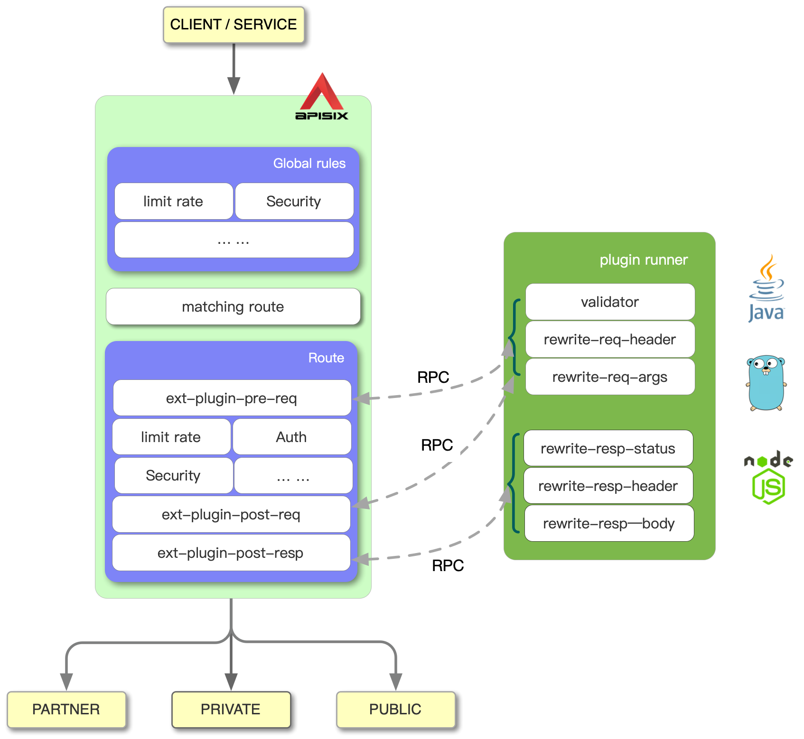

<!--
#
# Licensed to the Apache Software Foundation (ASF) under one or more
# contributor license agreements.  See the NOTICE file distributed with
# this work for additional information regarding copyright ownership.
# The ASF licenses this file to You under the Apache License, Version 2.0
# (the "License"); you may not use this file except in compliance with
# the License.  You may obtain a copy of the License at
#
#     http://www.apache.org/licenses/LICENSE-2.0
#
# Unless required by applicable law or agreed to in writing, software
# distributed under the License is distributed on an "AS IS" BASIS,
# WITHOUT WARRANTIES OR CONDITIONS OF ANY KIND, either express or implied.
# See the License for the specific language governing permissions and
# limitations under the License.
#
-->

## Prerequisites

* Go (>= 1.15)
* APISIX (>= 2.13.0)

## Installation

For now, we need to use Go Runner as a library. `cmd/go-runner` in this project is an official example showing how to use the Go Runner SDK.
We will also support loading pre-compiled plugins through the Go Plugin mechanism later.

## Development

### Developing with the Go Runner SDK

```bash
$ tree cmd/go-runner
cmd/go-runner
├── main.go
├── main_test.go
├── plugins
│ ├── say.go
│ └── say_test.go
└── version.go
```

Above is the directory structure of the official example. `main.go` is the entry point, where the most critical part is:

```go
cfg := runner.RunnerConfig{}
...
runner.Run(cfg)
```

`RunnerConfig` can be used to control the log level and log output location.

`runner.Run` will make the application listen to the target socket path, receive requests and execute the registered plugins. The application will remain in this state until it exits.

Then let's look at the plugin implementation.

Open `plugins/say.go`.

```go
func init() {
	err := plugin.RegisterPlugin(&Say{})
	if err ! = nil {
		log.Fatalf("failed to register plugin say: %s", err)
	}
}
```

Since `main.go` imports the plugins package,

```go
import (
  ...
	_ "github.com/apache/apisix-go-plugin-runner/cmd/go-runner/plugins"
  ...
)
```

in this way we register `Say` with `plugin.RegisterPlugin` before executing `runner.Run`.

`Say` needs to implement the following methods:

The `Name` method returns the plugin name.

```
func (p *Say) Name() string {
	return "say"
}
```

`ParseConf` will be called when the plugin configuration changes, parsing the configuration and returning the plugin specific configuration.

```
func (p *Say) ParseConf(in []byte) (interface{}, error) {
	conf := SayConf{}
	err := json.Unmarshal(in, &conf)
	return conf, err
}
```

The configuration of the plugin looks like this.

```
type SayConf struct {
	Body string `json: "body"`
}
```

`RequestFilter` will be executed on every request with the say plugin configured.

```
func (p *Say) RequestFilter(conf interface{}, w http.ResponseWriter, r pkgHTTP.Request) {
	body := conf.(SayConf).
	if len(body) == 0 {
		return
	}

	w.Header().Add("X-Resp-A6-Runner", "Go")
	_, err := w.Write([]byte(body))
	if err ! = nil {
		log.Errorf("failed to write: %s", err)
	}
}
```

We can see that the RequestFilter takes the value of the body set in the configuration as the response body. If we call `Write` or `WriteHeader` of the `http.ResponseWriter`
(respond directly in the plugin), it will response directly in the APISIX without touching the upstream. We can also set response headers in the plugin and touch the upstream
at the same time by set RespHeader in `pkgHTTP.Request`.

`ResponseFilter` supports rewriting the response during the response phase, we can see an example of its use in the ResponseRewrite plugin:

```go
type ResponseRewriteConf struct {
    Status  int               `json:"status"`
    Headers map[string]string `json:"headers"`
    Body    string            `json:"body"`
}

func (p *ResponseRewrite) ResponseFilter(conf interface{}, w pkgHTTP.Response) {
	cfg := conf.(ResponseRewriteConf)
	if cfg.Status > 0 {
		w.WriteHeader(200)
	}

	w.Header().Set("X-Resp-A6-Runner", "Go")
	if len(cfg.Headers) > 0 {
		for k, v := range cfg.Headers {
			w.Header().Set(k, v)
		}
	}

	if len(cfg.Body) == 0 {
		return
	}
	_, err := w.Write([]byte(cfg.Body))
	if err != nil {
		log.Errorf("failed to write: %s", err)
	}
}
```

We can see that `ResponseFilter` will rewrite the status, header, and response body of the response phase according to the configuration.

In addition, we can also get the status and headers in the original response through `pkgHTTP.Response`.

For the `pkgHTTP.Request` and `pkgHTTP.Response`, you can refer to the [API documentation](https://pkg.go.dev/github.com/apache/apisix-go-plugin-runner) provided by the Go Runner SDK.

After building the application (`make build` in the example), we need to set some environment variables at runtime:

* `APISIX_LISTEN_ADDRESS=unix:/tmp/runner.sock`

Like this:

```
APISIX_LISTEN_ADDRESS=unix:/tmp/runner.sock ./go-runner run
```

The application will listen to `/tmp/runner.sock` when it runs.

### Setting up APISIX (debugging)

First you need to have APISIX on your machine, which needs to be on the same instance as Go Runner.



The diagram above shows the workflow of APISIX on the left, while the plugin runner on the right is responsible for running external plugins written in different languages. apisix-go-plugin-runner is one such runner that supports Go.

When you configure a plugin runner in APISIX, APISIX will treat the plugin runner as a child process of its own. This sub-process belongs to the same user as the APISIX process. When we restart or reload APISIX, the plugin runner will also be restarted.

If you configure the ext-plugin-* plugin for a given route, a request to hit that route will trigger APISIX to make an RPC call to the plugin runner via a unix socket. The call is broken down into two phases.

- ext-plugin-pre-req: executed during handling the request, before most of the APISIX built-in plugins (Lua language plugins)
- ext-plugin-post-req: executed during handling the request, after most of the APISIX built-in plugins (Lua language plugins)
- ext-plugin-post-resp: executed during handling the response, after most of the APISIX built-in plugins (Lua language plugins)

Configure the timing of plugin runner execution as needed.

The plugin runner handles the RPC calls, creates a mock request from it, then runs the plugins written in other languages and returns the results to APISIX.

The order of execution of these plugins is defined in the ext-plugin-* plugin configuration. Like other plugins, they can be enabled and disabled on the fly.

Let's go back to the examples. To show how to develop Go plugins, we first set APISIX into debug mode. Add the following configuration to config.yaml.

```
ext-plugin:
  path_for_test: /tmp/runner.sock
```

This configuration means that after hitting a routing rule, APISIX will make an RPC request to /tmp/runner.sock.

Next, prepare the routing rule.

```
curl http://127.0.0.1:9080/apisix/admin/routes/1 -H 'X-API-KEY: edd1c9f034335f136f87ad84b625c8f1' -X PUT -d '
{
  "uri": "/get",
  "plugins": {
    "ext-plugin-pre-req": {
      "conf": [
        { "name": "say", "value":"{\"body\":\"hello\"}"}
      ]
    }
  },
  "upstream": {
        "type": "roundrobin",
        "nodes": {
            "127.0.0.1:1980": 1
        }
    }
}
'
```

Note that the plugin name is configured in `name` and the plugin configuration (after JSON serialization) is placed in `value`.

If you see `refresh cache and try again` warning on APISIX side and `key not found` warning on Runner side during development, this is due to configuration cache inconsistency. Because the Runner is not managed by APISIX in the development state, the internal state may be inconsistent. Don't worry, APISIX will retry.

Then we request: curl 127.0.0.1:9080/get

We can see that the interface returns hello and does not access anything upstream.

### Setting up APISIX (running)

Here's an example of go-runner, you just need to configure the command line to run it inside ext-plugin:

```
ext-plugin:
  # path_for_test: /tmp/runner.sock
  cmd: ["/path/to/apisix-go-plugin-runner/go-runner", "run"]
```

APISIX will treat the plugin runner as a child process of its own, managing its entire lifecycle.

APISIX will automatically assign a unix socket address for the runner to listen to when it starts. environment variables do not need to be set manually.
